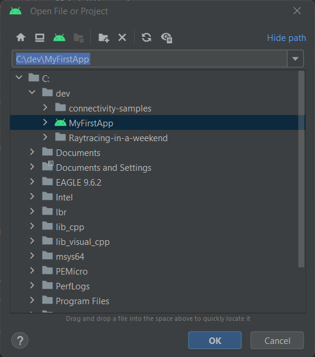

# MyFirstApp

### Installation

    git clone --recursive https://github.com/VoltXd/Montage-BLE-Android.git

### Open project
In Android Studio : File > Open.
Then, select the project :

## Warning
The booleans in [IfDef.java](/app/src/main/java/com/example/myfirstapp/IfDef.java) are used for educational purpose.
Set them to ``true`` to use the complete app.
